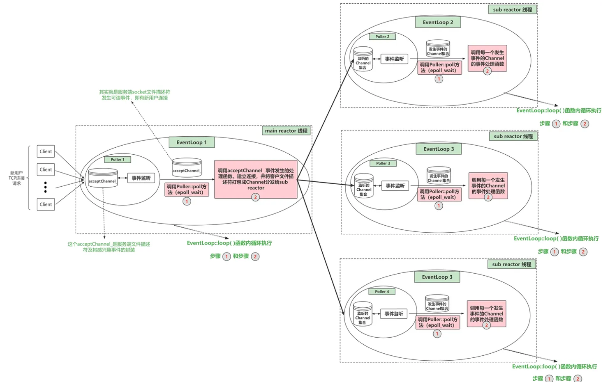
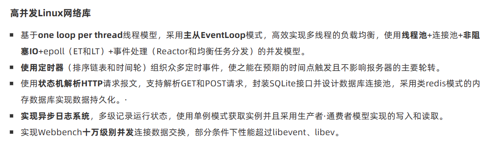

# Lucky : High-Concirrency C++ Network Library

## 项目简介

本项目基于主从Reactor模型的多线程网络库，使用C++11编写。

EventLoop1(即主Reactor)负责持续监听客户端的连接，将连接封装为Filed，使用Epoller(封装了Linux::epoll，实现非阻塞IO)对客户端连接进行管理，将其分发给子EventLoop，同样交给Epoller进行事件监听。

在Lucky中，每一个线程都可以看作是一个Reactor，主线程只负责监听接收新连接，并将接收的连接对应的Filed分发到子Reactor中，子线程就负责处理主线程分发给自己的fd上的事件，比如Filed上发生的可读、可写、错误等事件，从Filed上读取数据后，要进行的业务逻辑也是由子线程负责的。

## 学习要求

如果是从零开始接触本项目，请学习以下技术栈

* C++11特性，如：STL，智能指针，类型推导auto，lambda表达式，等
* Linux并发编程，线程池，epoll，互斥锁mutex，异步IO，等
* Linux网络编程，IP协议族，Socket系列函数：listen、bind，等
* 熟悉回调函数的使，std::bind()

如果你想将此项目写入你的简历，下面是一些参考

## 类的介绍

### 核心类

#### 1.Filed

Filed类封装了一个 [fd] 和这个 [fd感兴趣事件] 以及事件监听器监听到 [该fd实际发生的事件]。同时Filed类还提供了**设置**该fd的感兴趣事件，以及将该fd及其感兴趣事件**注册**到事件监听器或从事件监听器上**移除**，以及**保存**了该fd的每种事件对应的处理函数。

#### 2.Epoller

Epoller封装了Linux实现的epoll，**负责监听文件描述符事件是否触发**以及返回发生事件的文件描述符以及具体事件

#### 3.EventLoop

EventLoop就是负责实现“循环”**，负责驱动**“循环”的重要模块！！Filed和Poller其实相当于EventLoop的手下，EventLoop整合封装了二者并向上提供了更方便的接口来使用。

#### 4.Acceptor

Accetpor封装了服务器监听套接字fd以及相关处理方法。TcpServer发现Acceptor有一个新连接，则将此filed分发给一个subLoop。

#### 5.Server

Serve表示的是整个服务器，包含服务器的启动和定义各种回调函数

### 其他类

#### 6.Connection

主要封装了一个已建立的TCP连接，以及控制该TCP连接的方法（连接建立和关闭和销毁），以及该连接发生的各种事件（读/写/错误/连接）对应的处理函数，以及这个TCP连接的服务端和客户端的套接字地址信息等。

#### 7.Buffer

用户缓冲区

#### 8.LuckyLog

日志类

#### 9.Socket

封装了soclet fd的系列函数

#### 10.Thread

封装的线程的处理

#### 11.ManagerPool

实现的线程池

#### 12.Manager

将Thread与EventLoop联系起来

## 开发环境

* 操作系统：Ubuntu16、Ubuntu23
* 编译器：g++ 7.5.0
* 项目构建：cmake 3.10.2
